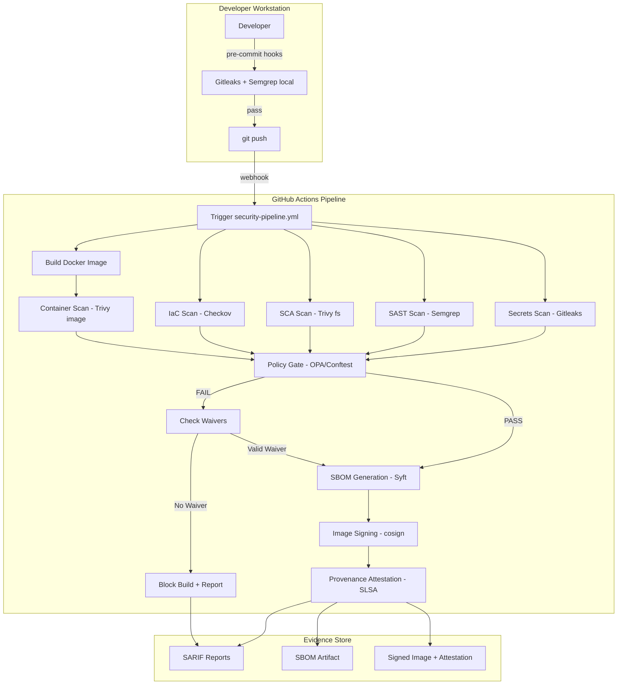
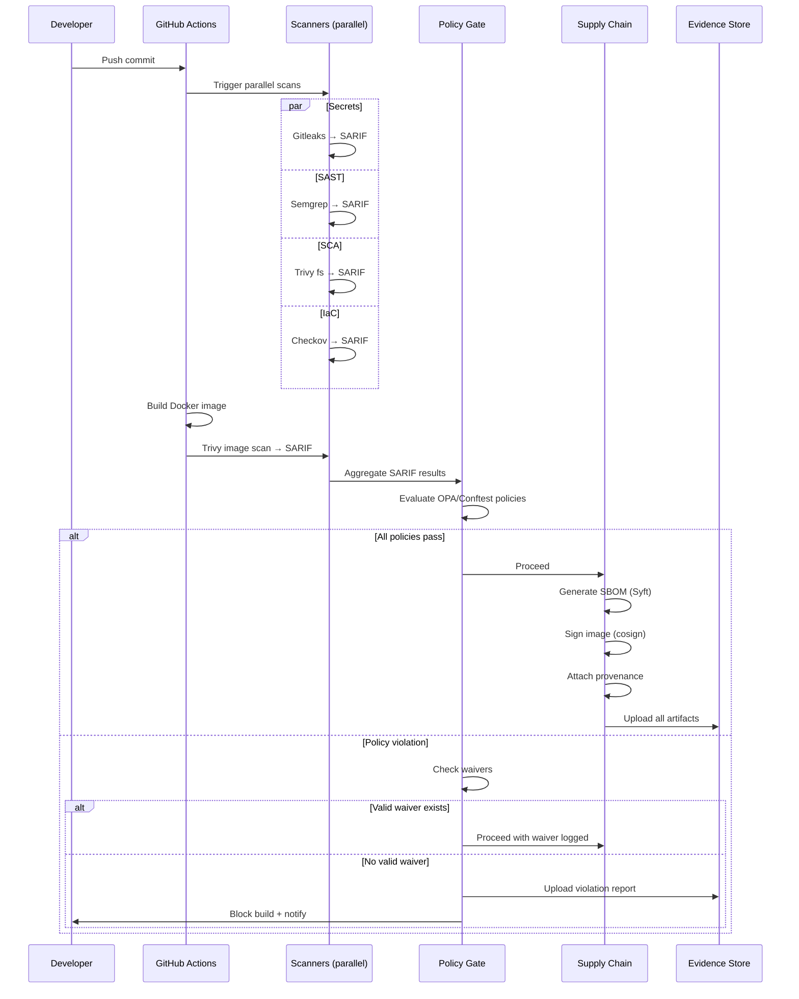
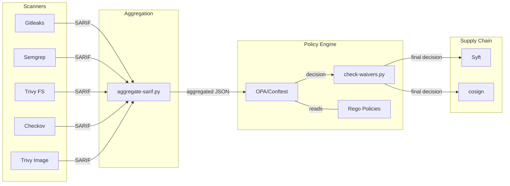

# Design Document

## Overview

This design describes the architecture and implementation approach for the Secure Software Factory — a multi-layer DevSecOps pipeline that wraps a representative vulnerable seed application with automated security scanning, policy-as-code enforcement, and supply-chain evidence generation. The system is built as a GitHub Actions workflow orchestrating OSS tools (Gitleaks, Semgrep, Trivy, Checkov, OPA/Conftest, Syft, cosign), producing auditable artifacts mapped to CNBV/IFPE and SOC 2 controls.

The factory targets ~25 engineers across 5 SWAT teams deploying continuously (Lead Time < 1h), embedding automatic security guardrails without degrading velocity. It includes a vulnerable seed application for demonstration, a phased rollout plan, threat modeling, ADRs, and regulatory compliance mapping.

## Architecture



### Pipeline Execution Flow



## Components and Interfaces

### Component Diagram



### Interface Definitions

#### Scanner Output Interface (SARIF)

Each scanner produces a SARIF 2.1.0 JSON file with the following structure consumed by the aggregator:

```python
@dataclass
class ScannerResult:
    tool_name: str          # e.g., "gitleaks", "semgrep", "trivy", "checkov"
    sarif_path: str         # path to the SARIF file
    findings_count: int     # number of findings detected
    exit_code: int          # 0 = no findings, 1 = findings detected, 2 = error
```

#### SARIF Aggregation Interface

```python
def aggregate_sarif(sarif_files: list[str]) -> dict:
    """
    Combines multiple SARIF files into a single aggregated report.
    
    Args:
        sarif_files: List of paths to individual SARIF 2.1.0 files
    
    Returns:
        Aggregated SARIF dict with all runs merged, preserving:
        - tool identity per run
        - all results with original locations
        - regulatory metadata tags
    
    Invariant: total findings in output == sum of findings across inputs
    """
```

#### Policy Gate Interface

```python
@dataclass
class PolicyViolation:
    policy_id: str          # e.g., "no_wildcard_iam"
    message: str            # human-readable explanation
    resource: str           # offending resource identifier
    severity: str           # "critical", "high", "medium", "low"
    regulatory_refs: list[str]  # e.g., ["IFPE-OPS-3", "SOC2-CC6.1"]

@dataclass
class PolicyDecision:
    passed: bool
    violations: list[PolicyViolation]
    waivers_applied: list[str]  # waiver IDs that allowed violations
    timestamp: str              # ISO 8601

def evaluate_policies(aggregated_sarif: dict, policies_dir: str) -> PolicyDecision:
    """
    Evaluates all Rego policies against aggregated scan results.
    Evaluates ALL policies (no short-circuit).
    Returns complete violation list.
    """
```

#### Waiver Interface

```python
@dataclass
class Waiver:
    waiver_id: str
    policy_id: str
    justification: str
    approver: str
    expiration_date: str    # ISO 8601 date
    resource: str           # resource this waiver applies to
    created_at: str         # ISO 8601

def check_waivers(violations: list[PolicyViolation], waivers_dir: str) -> tuple[list[PolicyViolation], list[Waiver]]:
    """
    Checks if any active, non-expired waivers cover the given violations.
    
    Returns:
        (remaining_violations, applied_waivers)
    
    Invariant: expired waivers are never applied
    Invariant: len(remaining) + len(applied) == len(input violations)
    """
```

#### Supply Chain Interface

```python
@dataclass
class SupplyChainEvidence:
    sbom_path: str          # path to SPDX JSON SBOM
    image_digest: str       # sha256 digest of signed image
    signature_ref: str      # cosign signature reference
    provenance: dict        # SLSA provenance attestation content
    source_repo: str
    commit_sha: str
    workflow_run_id: str
```

#### Pre-commit Hook Interface

```yaml
# .pre-commit-config.yaml structure
repos:
  - repo: https://github.com/gitleaks/gitleaks
    hooks:
      - id: gitleaks
        # Blocks commit on secret detection
        # Output: file path + line number of detected secret
  - repo: https://github.com/semgrep/semgrep
    hooks:
      - id: semgrep
        # Runs subset of SAST rules for speed
        # Target: < 30s for < 50 files
```

### Phased Enforcement Interface

```python
@dataclass
class TeamConfig:
    team_id: str
    enforcement_level: str  # "warning" | "enforcing"
    transition_date: str | None  # when enforcement begins (ISO 8601)
    notified: bool          # whether 5-day notice was sent

def get_enforcement_mode(team_id: str, config_path: str) -> str:
    """Returns 'warning' or 'enforcing' for the given team."""
```

## Data Models

### SARIF Report Schema (SARIF 2.1.0)

```json
{
  "$schema": "https://raw.githubusercontent.com/oasis-tcs/sarif-spec/master/Schemata/sarif-schema-2.1.0.json",
  "version": "2.1.0",
  "runs": [
    {
      "tool": {
        "driver": {
          "name": "gitleaks | semgrep | trivy | checkov",
          "version": "x.y.z",
          "rules": []
        }
      },
      "results": [
        {
          "ruleId": "string",
          "level": "error | warning | note",
          "message": { "text": "string" },
          "locations": [{ "physicalLocation": { "artifactLocation": { "uri": "string" }, "region": { "startLine": 0 } } }],
          "properties": {
            "regulatory_refs": ["IFPE-OPS-3", "SOC2-CC6.1"]
          }
        }
      ]
    }
  ]
}
```

### Waiver Schema

```json
{
  "waiver_id": "string (UUID)",
  "policy_id": "string (matches Rego policy name)",
  "resource": "string (resource identifier the waiver covers)",
  "justification": "string (reason for exception)",
  "approver": "string (email or GitHub handle of approver)",
  "expiration_date": "string (ISO 8601 date, e.g., 2025-03-01)",
  "created_at": "string (ISO 8601 datetime)"
}
```

### Policy Decision Record

```json
{
  "decision_id": "string (UUID)",
  "commit_sha": "string",
  "timestamp": "string (ISO 8601)",
  "passed": "boolean",
  "violations": [
    {
      "policy_id": "string",
      "message": "string",
      "resource": "string",
      "severity": "critical | high | medium | low",
      "regulatory_refs": ["string"]
    }
  ],
  "waivers_applied": [
    {
      "waiver_id": "string",
      "policy_id": "string",
      "approver": "string",
      "expiration_date": "string"
    }
  ],
  "scan_summary": {
    "total_findings": "integer",
    "by_scanner": {
      "gitleaks": "integer",
      "semgrep": "integer",
      "trivy_fs": "integer",
      "checkov": "integer",
      "trivy_image": "integer"
    }
  }
}
```

### SBOM Schema (SPDX 2.3 JSON)

```json
{
  "spdxVersion": "SPDX-2.3",
  "dataLicense": "CC0-1.0",
  "documentNamespace": "string",
  "name": "string",
  "packages": [
    {
      "name": "string",
      "versionInfo": "string",
      "downloadLocation": "string",
      "supplier": "string",
      "checksums": [{ "algorithm": "SHA256", "checksumValue": "string" }]
    }
  ],
  "relationships": []
}
```

### Team Configuration Schema

```json
{
  "teams": [
    {
      "team_id": "string",
      "name": "string",
      "enforcement_level": "warning | enforcing",
      "transition_date": "string | null (ISO 8601)",
      "notified": "boolean",
      "repositories": ["string"]
    }
  ]
}
```

### Regulatory Mapping Entry

```json
{
  "pipeline_control": "string (e.g., 'IaC Scanner - no_wildcard_iam')",
  "cnbv_ifpe_ref": "string (e.g., 'IFPE Art. 58 - Operational Security')",
  "soc2_tsc_ref": "string (e.g., 'CC6.1 - Logical and Physical Access')",
  "evidence_artifact": "string (path to SARIF or policy decision)"
}
```


## Correctness Properties

*A property is a characteristic or behavior that should hold true across all valid executions of a system — essentially, a formal statement about what the system should do. Properties serve as the bridge between human-readable specifications and machine-verifiable correctness guarantees.*

### Property 1: Policy gate detects violations and produces human-readable output

*For any* structured scan result containing a policy violation (unencrypted storage, IAM wildcard, root container, or open security group), the Policy Gate SHALL detect the violation AND produce output containing both the violated policy identifier and the offending resource name.

**Validates: Requirements 3.1, 3.2**

### Property 2: Exhaustive policy evaluation

*For any* set of scan results containing N distinct policy violations, the Policy Gate SHALL report exactly N violations — evaluating all policies without short-circuiting, so no violations are suppressed or duplicated.

**Validates: Requirements 3.5**

### Property 3: Waiver validity determines gate passage

*For any* policy violation paired with a waiver, if the waiver's `policy_id` matches the violation, the waiver's `resource` matches the violation's resource, and the waiver's `expiration_date` is in the future, THEN the Policy Gate SHALL allow passage. Conversely, if the waiver is expired (expiration_date in the past), the Policy Gate SHALL block the build identically to having no waiver at all.

**Validates: Requirements 3.4, 9.4**

### Property 4: Waiver schema validation rejects incomplete waivers

*For any* waiver object missing one or more required fields (justification, approver, expiration_date, policy_id, resource), the waiver validation function SHALL reject the waiver and never apply it to grant passage.

**Validates: Requirements 9.4**

### Property 5: SARIF aggregation preserves findings and attaches regulatory metadata

*For any* set of valid SARIF 2.1.0 files from individual scanners, the aggregated SARIF output SHALL contain exactly the sum of findings from all input files (no findings lost or duplicated), and each finding SHALL include `regulatory_refs` metadata tags from the regulatory mapping.

**Validates: Requirements 8.3, 2.4**

### Property 6: Team enforcement mode resolves independently

*For any* set of team configurations where teams have different enforcement levels (warning vs enforcing), the enforcement decision for a given team SHALL depend only on that team's configuration — never on other teams' configurations. A team in "warning" mode SHALL never have its build blocked by policy violations.

**Validates: Requirements 9.1, 9.2**

### Property 7: Enforcement notification scheduling

*For any* team transition from warning mode to enforcement mode, the notification date SHALL be at least 5 business days before the enforcement start date. If the transition date would not allow 5 business days of notice, the system SHALL flag the configuration as invalid.

**Validates: Requirements 9.3**

### Property 8: Audit trail completeness for waivers

*For any* waiver that is granted and applied to a policy violation, the audit trail record SHALL contain the waiver justification, approver identity, expiration date, and the associated policy violation details. No field SHALL be empty or missing.

**Validates: Requirements 10.2**

### Property 9: Per-run summary report completeness

*For any* pipeline run producing scan findings and policy decisions, the generated summary report SHALL link the commit SHA, all scan findings (with per-scanner counts), all policy decisions (pass/fail with violation details), applied waivers, and the resulting build status into a single record where the total findings count equals the sum of per-scanner counts.

**Validates: Requirements 10.3**

## Error Handling

### Scanner Failures

| Scenario | Behavior | Rationale |
|---|---|---|
| Scanner binary not found | Job fails with clear error message; other scanners continue | Independence requirement (2.5) |
| Scanner timeout (>5 min per scanner) | Job killed, reported as error finding in SARIF | Prevent pipeline from exceeding 10-min budget |
| Scanner produces invalid SARIF | Aggregator logs warning, skips invalid file, reports incomplete scan | Fail-open for individual scanner but aggregator reports gap |
| Scanner returns unexpected exit code | Treated as error, logged, other scanners unaffected | Defense-in-depth — one scanner failure ≠ pass |

### Policy Gate Failures

| Scenario | Behavior | Rationale |
|---|---|---|
| OPA/Conftest binary unavailable | Build fails (fail-closed) | Policy gate is security-critical — absence = block |
| Rego policy syntax error | Build fails with error pointing to malformed policy file | Prevent silent policy bypass |
| Waiver file malformed JSON | Waiver ignored (treated as absent), build blocks if violation exists | Fail-closed on waiver parsing errors |
| Waiver directory missing | No waivers applied, proceed with standard evaluation | Valid state — no waivers configured |

### Supply Chain Failures

| Scenario | Behavior | Rationale |
|---|---|---|
| Syft fails to generate SBOM | Build fails (SBOM is required evidence) | Compliance requirement — no SBOM = no deploy |
| cosign signing fails | Build fails — unsigned images must not be deployed | Supply chain integrity requirement |
| OIDC token unavailable for keyless signing | Fall back to error; do not skip signing | Never produce unsigned artifacts |

### Pre-commit Hook Failures

| Scenario | Behavior | Rationale |
|---|---|---|
| Gitleaks binary not installed | Hook skipped with warning message | Don't block developer workflow for missing optional tool |
| Hook exceeds 30s timeout | Hook aborted, commit allowed with warning | Preserve developer velocity (Req 11.3) |
| Hook crashes | Commit allowed, warning displayed to install/update | Fail-open locally; pipeline catches in CI |

### Phased Rollout Errors

| Scenario | Behavior | Rationale |
|---|---|---|
| Team config file missing | Default to "warning" mode | Fail-safe — new teams are not blocked unexpectedly |
| Unknown team_id in pipeline | Default to "enforcing" mode | Fail-closed for unknown origins |
| Transition date in past without notification sent | Log error, proceed with enforcement, alert admin | Cannot retroactively notify but should not defer indefinitely |

## Testing Strategy

### Unit Tests (Example-Based)

Unit tests verify specific scenarios, edge cases, and integration points:

- **Vulnerable seed validation**: Verify each planted vulnerability is present in the correct file (1.1–1.3)
- **Red/Green demo outcomes**: Verify red-demo fails and green-demo passes with expected findings (5.1–5.4)
- **Documentation structure**: Verify required sections exist in threat model, ADRs, regulatory mapping, README (6.x, 7.x, 8.x, 12.x)
- **Pre-commit hook behavior**: Verify secret detection blocks commit with file/line info (11.2)
- **SARIF format validation**: Verify scanner outputs conform to SARIF 2.1.0 schema (2.4)

### Property-Based Tests

Property-based tests verify universal properties across randomly generated inputs. The project uses **Hypothesis** (Python) for property-based testing.

**Configuration:**
- Minimum 100 iterations per property test
- Each test tagged with: `Feature: secure-software-factory, Property {N}: {property_text}`

**Properties to implement:**

| Property | Module Under Test | Generator Strategy |
|---|---|---|
| P1: Policy violation detection | `policies/opa/*.rego` via Conftest | Random Terraform plan JSON with/without violations |
| P2: Exhaustive evaluation | `scripts/evaluate_policies.py` | Random sets of 1-10 violations across policies |
| P3: Waiver validity | `scripts/check-waivers.py` | Random waivers with valid/expired/mismatched fields |
| P4: Waiver schema validation | `scripts/check-waivers.py` | Random waiver objects with selectively removed fields |
| P5: SARIF aggregation | `scripts/aggregate-sarif.py` | Random SARIF files with 0-50 findings each |
| P6: Team enforcement mode | `scripts/enforcement.py` | Random team configs with mixed levels |
| P7: Notification scheduling | `scripts/enforcement.py` | Random transition dates across weekdays/weekends/holidays |
| P8: Audit trail completeness | `scripts/audit.py` | Random waiver grants with varying field content |
| P9: Summary report completeness | `scripts/report.py` | Random pipeline runs with varying finding counts |

### Integration Tests

Integration tests verify external tool behavior and end-to-end pipeline operation:

- **Scanner execution**: Each scanner runs against vulnerable-app/ and produces findings (1.4, 2.1–2.5)
- **Pipeline trigger**: Push triggers all scan jobs automatically (2.2)
- **Performance**: Pipeline completes within 10 minutes (2.3)
- **SBOM generation**: Syft produces SBOM with all packages from requirements.txt (4.1)
- **Image signing**: cosign signs and verifies image with provenance (4.2, 4.4)
- **Artifact retention**: Artifacts uploaded with correct retention policy (10.1)
- **Pre-commit performance**: Hooks complete within 30s on 50-file changeset (11.3)

### Test Pyramid

```
        ╱╲
       ╱  ╲      Integration Tests (external tools, E2E pipeline)
      ╱    ╲     ~15 tests, run in CI only
     ╱──────╲
    ╱        ╲    Property Tests (core logic verification)
   ╱          ╲   9 properties × 100 iterations = 900 executions
  ╱────────────╲
 ╱              ╲  Unit Tests (specific examples, edge cases, docs validation)
╱                ╲ ~30 tests, fast local execution
╱──────────────────╲
```

### Test Tooling

| Layer | Tool | Scope |
|---|---|---|
| Unit | pytest | Python scripts, config validation |
| Property | Hypothesis (pytest plugin) | Core logic modules |
| Integration | GitHub Actions + pytest | Full pipeline, external tools |
| Smoke | Shell scripts / pytest | Documentation structure, file existence |

