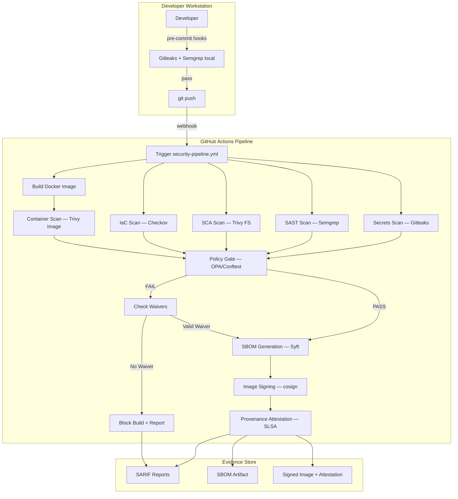

# Secure Software Factory

A production-grade DevSecOps pipeline for a fintech treasury and FX platform operating in the Mexico-US corridor. This factory embeds multi-layer security scanning, policy-as-code enforcement, and supply-chain evidence generation into CI/CD without degrading developer velocity.

Built for ~25 engineers across 5 SWAT teams deploying continuously (Lead Time < 1 hour), the system produces auditable artifacts mapped to **CNBV/IFPE** and **SOC 2** controls.

---

## Architecture



---

## Pipeline Layers

| Layer | Tool | What It Detects |
|-------|------|-----------------|
| **Secrets Scanning** | [Gitleaks](https://github.com/gitleaks/gitleaks) | Hardcoded secrets, API keys, credentials in source code and git history |
| **SAST** | [Semgrep](https://semgrep.dev/) | Code-level vulnerabilities: injection flaws, insecure patterns |
| **SCA** | [Trivy FS](https://trivy.dev/) | Known CVEs in third-party dependencies |
| **IaC Scanning** | [Checkov](https://www.checkov.io/) | Infrastructure misconfigurations in Terraform (public buckets, wildcard IAM, open SGs) |
| **Container Scanning** | [Trivy Image](https://trivy.dev/) | OS and application vulnerabilities in Docker images |
| **Policy Gate** | [OPA/Conftest](https://www.conftest.dev/) | Custom business-specific policy enforcement (Rego rules) |
| **SBOM** | [Syft](https://github.com/anchore/syft) | Complete dependency inventory (SPDX 2.3 format) |
| **Image Signing** | [cosign](https://github.com/sigstore/cosign) | Cryptographic image signatures and SLSA provenance attestation |

All scanners output **SARIF 2.1.0** reports, which are aggregated and evaluated against Rego policies before the build proceeds.

---

## Red/Green Demo

The repository includes two demonstration workflows that prove the pipeline works end-to-end.

### Red Demo (Vulnerable Code Blocked)

The red demo runs the full pipeline against deliberately insecure code (`vulnerable-app/` and `iac/vulnerable/`). The pipeline detects findings in every layer and the policy gate **blocks** the build.

**Trigger in CI:**

```bash
# Option 1: Manual dispatch from GitHub Actions UI
# Go to Actions → "Red Demo — Vulnerable Code Detection" → Run workflow

# Option 2: Push to demo/ branch
git checkout -b demo/red-test
git push -u origin demo/red-test
```

**Run locally with pytest:**

```bash
pytest tests/ -k "red" -v
```

### Green Demo (Remediated Code Passes)

The green demo runs the same pipeline against remediated code (`remediated-app/` and `iac/remediated/`). All policy violations are resolved and the pipeline **passes**.

**Trigger in CI:**

```bash
# Option 1: Manual dispatch from GitHub Actions UI
# Go to Actions → "Green Demo — Secure Path Validation" → Run workflow

# Option 2: Push to demo/ branch (triggers both demos)
git checkout -b demo/green-test
git push -u origin demo/green-test
```

**Run locally with pytest:**

```bash
pytest tests/ -k "green" -v
```

### What Each Demo Validates

| Demo | Expected Outcome | Requirement |
|------|------------------|-------------|
| Red | Policy gate FAILS, all layers report findings | Req 5.1, 5.3 |
| Green | Policy gate PASSES, no policy violations | Req 5.2, 5.4 |

---

## Getting Started

### Prerequisites

- Python 3.12+
- pip
- Docker (for container scanning and image builds)
- Git

### Setup

```bash
# Clone the repository
git clone https://github.com/your-org/The-Secure-Software-Factory.git
cd The-Secure-Software-Factory

# Install pre-commit hooks (Gitleaks + Semgrep run on every commit)
make setup-hooks

# Install Python dependencies
pip install -e ".[dev]"
```

### Running Tests

```bash
# Run the full test suite
make test

# Run specific test categories
pytest tests/unit/ -v          # Unit tests
pytest tests/property/ -v      # Property-based tests (Hypothesis)
pytest tests/integration/ -v   # Integration tests

# Run linting (all pre-commit hooks)
make lint
```

### Available Make Targets

| Target | Description |
|--------|-------------|
| `make help` | Show all available targets |
| `make setup-hooks` | Install pre-commit and configure git hooks |
| `make test` | Run the full pytest suite |
| `make lint` | Run all pre-commit hooks on the entire repo |
| `make clean` | Remove cached pre-commit environments |

---

## Project Structure

```
The-Secure-Software-Factory/
├── .github/workflows/
│   ├── security-pipeline.yml   # Main security pipeline (triggered on push)
│   ├── red-demo.yml            # Red demo workflow (vulnerable code)
│   └── green-demo.yml          # Green demo workflow (remediated code)
├── vulnerable-app/             # Deliberately insecure FastAPI app (seed)
│   ├── main.py                 # Contains hardcoded secret + SQL injection
│   ├── Dockerfile              # Runs as root user
│   └── requirements.txt        # Includes dependency with known CVE
├── remediated-app/             # Secure version of the application
│   ├── main.py                 # Secrets externalized, injection fixed
│   ├── Dockerfile              # Non-root user, minimal base image
│   └── requirements.txt        # Updated dependencies, no known CVEs
├── iac/
│   ├── vulnerable/             # Terraform with misconfigurations
│   │   └── main.tf            # Public S3, wildcard IAM, open SG
│   └── remediated/             # Compliant Terraform
│       └── main.tf            # Encrypted storage, least-privilege IAM
├── policies/opa/               # Custom Rego policy rules
│   ├── no_unencrypted_storage.rego
│   ├── no_wildcard_iam.rego
│   ├── no_root_container.rego
│   └── no_open_security_group.rego
├── scripts/                    # Pipeline automation scripts
│   ├── aggregate_sarif.py      # Merges SARIF reports from all scanners
│   ├── evaluate_policies.py    # Runs OPA/Conftest policy evaluation
│   ├── check_waivers.py        # Validates and applies waivers
│   ├── enforcement.py          # Phased rollout enforcement logic
│   ├── audit.py                # Audit trail generation
│   └── report.py               # Per-run summary report generation
├── config/
│   ├── teams.json              # Per-team enforcement configuration
│   └── regulatory-mapping.json # CNBV/IFPE + SOC 2 control mappings
├── schemas/                    # JSON Schemas for data validation
├── waivers/                    # Active and expired waiver definitions
├── docs/                       # Project documentation
│   ├── adr/                    # Architecture Decision Records
│   └── threat-model.md         # Structured threat model
├── tests/
│   ├── unit/                   # Example-based unit tests
│   ├── property/               # Hypothesis property-based tests
│   └── integration/            # End-to-end integration tests
├── .pre-commit-config.yaml     # Pre-commit hook configuration
├── Makefile                    # Developer automation targets
└── pyproject.toml              # Python project configuration
```

---

## Documentation

### Architecture Decision Records (ADRs)

Each scanning tool was selected with documented rationale, trade-offs, and alternatives considered:

| ADR | Decision |
|-----|----------|
| [ADR-001](docs/adr/001-gitleaks-secrets-scanning.md) | Gitleaks for secrets scanning |
| [ADR-002](docs/adr/002-semgrep-sast.md) | Semgrep for SAST |
| [ADR-003](docs/adr/003-trivy-sca-container.md) | Trivy for SCA and container scanning |
| [ADR-004](docs/adr/004-checkov-iac-scanning.md) | Checkov for IaC scanning |
| [ADR-005](docs/adr/005-syft-sbom.md) | Syft for SBOM generation |
| [ADR-006](docs/adr/006-cosign-signing.md) | cosign for image signing and provenance |

### Threat Model

The [Threat Model](docs/threat-model.md) covers:
- Supply-chain attacks on dependencies
- Compromised build environment
- Insider threats
- External adversaries targeting the service

Each threat maps to a pipeline layer or control that mitigates it, with residual risks documented.

### Regulatory Mappings

- **CNBV/IFPE Controls** — Pipeline controls mapped to IFPE operational security requirements
- **SOC 2 Trust Services Criteria** — Scanning layers mapped to SOC 2 CC criteria

The mapping configuration is in [`config/regulatory-mapping.json`](config/regulatory-mapping.json). SARIF reports include `regulatory_refs` metadata tags for audit traceability.

---

## Cost Estimation

Production cost estimate for running the Secure Software Factory at production scale (25 engineers, 5 teams).

### Tooling Costs

| Component | Cost | Notes |
|-----------|------|-------|
| Gitleaks | $0 | OSS (MIT) |
| Semgrep | $0 | OSS community rules (LGPL-2.1) |
| Trivy | $0 | OSS (Apache-2.0) |
| Checkov | $0 | OSS (Apache-2.0) |
| Syft | $0 | OSS (Apache-2.0) |
| cosign | $0 | OSS (Apache-2.0), keyless via Sigstore |
| OPA/Conftest | $0 | OSS (Apache-2.0) |
| **Total licensing** | **$0** | All tools are open-source |

### GitHub Actions Compute

| Metric | Estimate |
|--------|----------|
| Pipeline runs per day | ~50 (25 engineers × 2 pushes avg) |
| Minutes per pipeline run | ~8 minutes |
| Monthly compute minutes | ~12,000 minutes |
| GitHub Actions included (Team plan) | 3,000 min/month |
| Overage (Linux runners @ $0.008/min) | ~$72/month |
| **Monthly CI/CD compute** | **~$72–$100/month** |

### Artifact Storage (2-Year Retention)

| Artifact Type | Size per Run | Monthly Volume | 2-Year Total |
|---------------|-------------|----------------|--------------|
| SARIF reports | ~50 KB | ~75 MB | ~1.8 GB |
| SBOMs | ~200 KB | ~300 MB | ~7.2 GB |
| Policy decisions | ~5 KB | ~7.5 MB | ~180 MB |
| Signed images + attestations | ~100 MB | ~150 GB | ~3.6 TB |
| **Total storage** | — | — | **~3.6 TB** |

Storage costs depend on backend (GitHub Artifacts, S3, or OCI registry). Estimated at $0.023/GB (S3 Standard): **~$83/month** for full retention.

### Total Monthly Cost Summary

| Category | Monthly Estimate |
|----------|-----------------|
| Tool licensing | $0 |
| CI/CD compute (GitHub Actions) | $72–$100 |
| Artifact storage (S3, 2-year retention) | $83 |
| **Total** | **~$155–$183/month** |

> **Note:** Costs scale linearly with team size and push frequency. The all-OSS stack eliminates per-seat licensing fees that commercial alternatives (Snyk, SonarQube Enterprise, JFrog Xray) would add ($50–$150/developer/month).

---

## License

This project is provided for demonstration and evaluation purposes.

## Contributing

1. Fork the repository
2. Create a feature branch (`git checkout -b feature/your-feature`)
3. Install pre-commit hooks (`make setup-hooks`)
4. Make your changes and ensure tests pass (`make test`)
5. Submit a pull request

All contributions must pass the full security pipeline before merging.
